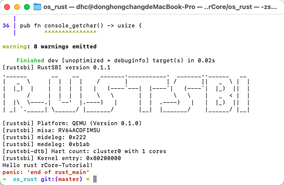
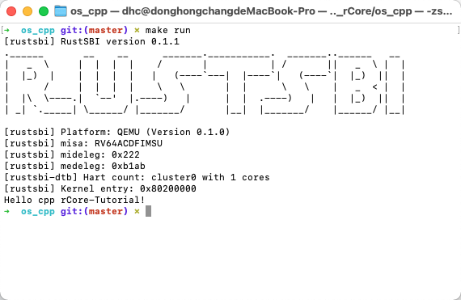
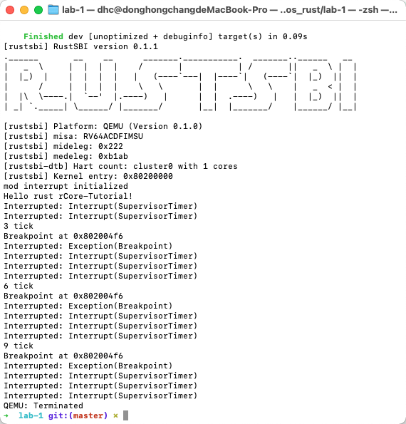
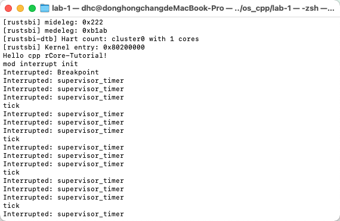

#[rCore-Tutorial](https://github.com/rcore-os/rCore-Tutorial)

cpp and rust

---

###[lab-0](https://github.com/rcore-os/rCore-Tutorial/tree/master/docs/lab-0/guide)

---

###[lab-1](https://github.com/rcore-os/rCore-Tutorial/tree/master/docs/lab-1/guide)

---
